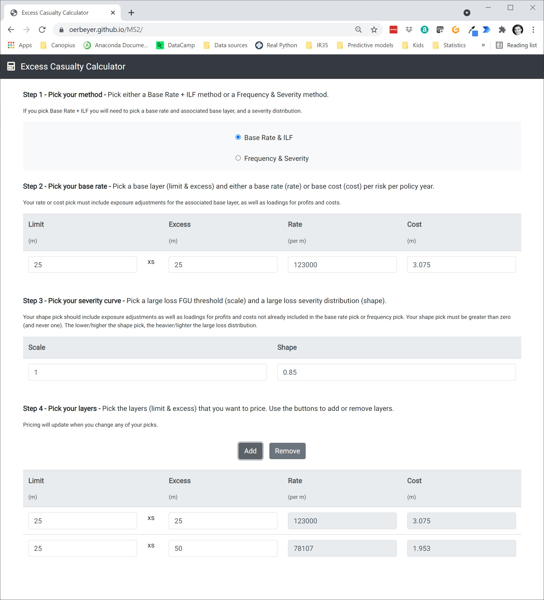

# MS2 Excess Casualty Calculator

[View the live project here.](https://oerbeyer.github.io/MS2/index.html)

This simple, single page app is aimed at London Market Excess Casualty insurance underwriters. It is a calculator for pricing one or more layers of insurance. It supports two methods and provides clear steps and instructions for the user to follow. It can be used on mobile and desktop/laptop devices.

Simplicity, speed and flexibility are the most valued attributes. It is simple and professional by design. It is the first of its kind.



<br>

## User Experience (UX)

### User stories

As a... | I want... | So that...
:-: | --- | --- 
Underwriter | to simply, quickly and accurately price one ore more layers of insurance | I can do a transaction.
Underwriter | to know the impact of different methods on price | I can make informed decisions.
Underwriter | to know the impact of different inputs for a given method on price | I can make informed decisions.
Underwriter | to quickly and easily add or remove layers from pricing | I can consider alternative layer options.
Underwriter | to know how I'm supposed to use the calculator | I can use it correctly.

### Design

#### Colour Scheme

-   Black, grey and white.

#### Typography

-   The Robotto font is the main font used throughout the whole website with Sans Serif as the fallback font in case for any reason the font isn't being imported into the site correctly. Chosen for clarity, simplicity and professional touch.
#### Imagery

-   Apart from a single calculator icon, no images are used.

### Wireframes

-   This is a single page app. Wireframes would be excessive so no wireframes are used.

<br>

## Features

-   Responsive on all device sizes

-   Interactive elements

-   Dynamic user selection and inputs triggering calculations

<br>

## Technologies Used

### Languages Used

-   [HTML5](https://en.wikipedia.org/wiki/HTML5)
-   [CSS3](https://en.wikipedia.org/wiki/Cascading_Style_Sheets)
-   [JavaScript](https://en.wikipedia.org/wiki/JavaScript)

### Frameworks, Libraries & Programs Used

1. [Bootstrap 4.4.1:](https://getbootstrap.com/docs/4.4/getting-started/introduction/)
Bootstrap was used to assist with the responsiveness and styling of the website.
2. [Google Fonts:](https://fonts.google.com/)
Google fonts were used to import the 'Titillium Web' font into the style.css file which is used on all pages throughout the project.
3. [Font Awesome:](https://fontawesome.com/)
Font Awesome was used on all pages throughout the website to add icons for aesthetic and UX purposes.
4. [jQuery:](https://jquery.com/)
jQuery came with Bootstrap to make the navbar responsive but was also used for the smooth scroll function in JavaScript.
5. [Git](https://git-scm.com/)
Git was used for version control by utilizing the Gitpod terminal to commit to Git and Push to GitHub.
6. [GitHub:](https://github.com/)
GitHub is used to store the projects code after being pushed from Git.

<br>

## Testing

The W3C Markup Validator and W3C CSS Validator Services were used to validate every page of the project to ensure there were no syntax errors in the project.

-   [W3C Markup Validator](https://jigsaw.w3.org/css-validator/) - Pass
-   [W3C CSS Validator](https://jigsaw.w3.org/css-validator/) - Pass
-   [JSHint](https://jshint.com/) - [Results](https://github.com/) - Pass

### User Stories Testing

-   User stroies were incoroporated in design and manually tested.

### Further Testing

-   The Website was tested on Google Chrome.
-   The website was viewed on a variety of devices such as Laptop and Mobile devices.
-   App calculations were cross-checked against MS Excel calculations.

### Known Bugs

-   On some mobile devices the table inputs become very small.
-   Future iterations should allow the user to add and remove analyses (the entire calculation set) in the same way that it currently allows the user to add and remove layers.
-   Future iterations should include data validation.
-   Future iterations should assist in the interpretation of selections, inputs and outputs.

<br>

## Deployment

### GitHub Pages

The project was deployed to GitHub Pages using the following steps...

1. Log in to GitHub and locate the [GitHub Repository](https://github.com/)
2. At the top of the Repository (not top of page), locate the "Settings" Button on the menu.
3. In the menu on the left click on the "Pages" item
4. Under "Source", click the dropdown called "None" and select "Main Branch".
5. The page will automatically refresh.
6. A link to the the now published site should appear in the refreshed page.

### Forking the GitHub Repository

By forking the GitHub Repository we make a copy of the original repository on our GitHub account to view and/or make changes without affecting the original repository by using the following steps...

1. Log in to GitHub and locate the [GitHub Repository](https://github.com/)
2. At the top of the Repository (not top of page) just above the "Settings" Button on the menu, locate the "Fork" Button.
3. You should now have a copy of the original repository in your GitHub account.

### Making a Local Clone

1. Log in to GitHub and locate the [GitHub Repository](https://github.com/)
2. Under the repository name, click "Clone or download".
3. To clone the repository using HTTPS, under "Clone with HTTPS", copy the link.
4. Open Git Bash
5. Change the current working directory to the location where you want the cloned directory to be made.
6. Type `git clone`, and then paste the URL you copied in Step 3.
```
$ git clone https://github.com/YOUR-USERNAME/YOUR-REPOSITORY
```
7. Press Enter. Your local clone will be created.

<br>

## Credits

### Code

-   [Bootstrap4](https://getbootstrap.com/docs/4.4/getting-started/introduction/): Bootstrap Library used throughout the project to make the app minimally responsive and to add simple yet professional styling.

-   [jQuery](https://jquery.com/): jQuery Library used throughout the project mainly to make user selections, inputs and calculations interactive.

### Content

-   All content was written by the developer.

### Media

-   [Google Fonts](https://fonts.google.com/)

-   [Font Awesome](https://fontawesome.com/)

### Acknowledgements

-   Tutor support at Code Institute for their support.